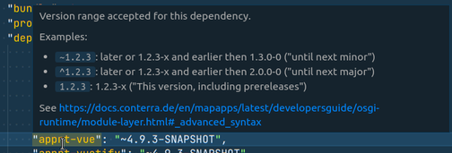

# 0.3.0

This version consequently improves navigation between code and manifest of a bundle.

* **[Go to component implementation](#go-to-component-implementation)** - Click on a component's name in the manifest to jump to its implementation file.
* **[Quickly access manifest and readme](#qickly-access-manifest-and-readme)** - Whatever file in a bundle your are currently working on -- open the corresponding manifest.json or README&#46;md with a single command.
* **[Open bundles even quicker](#open-bundles-even-quicker)** - Not the only improvement to  the "Open bundle" command: recently used bundles are displayed on top of the list.
* **[Highlight deprecated manifest elements](#highlight-deprecated-manifest-elements)** - Deprecated manifest keys get reported in the Problems view and are not displyaed on auto-suggest any more. 
* **[Improved manifest editing snippets](#improved-manifest-editing-snippets)** - Snippets for a selection of manifest keys will help you enter values without less key strokes.
* **[Exclude distracting bundles](#exclude-distracting-bundles)** - Define folders to be ignored when searching for bundles or displaying them in lists. 

And, of course, some bug fixes properly listed the [changelog](CHANGELOG.html).

## Go to component implementation

Maybe a change that you won't necessarily recognize, but yet pleasant to know:
The extension is not started every time you open VS Code any more.
Especially if you just fire up VS Code to edit some files in between you don't want to wait any extra (milli)second for it to show up. 
Now the extension is only loaded, when your workspace contains any bundles, i.e. manifest.json files.

There is one downside to it:
If you start a new project and create the very first manifest.json file in your workspace, VS Code won't start the extension for you --
no service name auto-completion, no documentation hovers etc... :cry: 
    
...until you saved your initial manifest.json file and restarted VS Code.
Or you run the new command **apprt-bundles: Activate extension** from the command palette.

## Qickly access manifest and readme

Documentation hovers got some polish to become more readable and help get the important information easier.

Simple things like inline code formatting or just bulleted lists improve the way information is conveyed
(and yes, you can still switch documentation hovers off completely...)

## Open bundles even quicker

With the introduction of webpack the **file size** of the extension decreased to nearly 100kB -- down from ~3MB.
Ok, some unnecessary image and documentation files were removed also, but yet!

When you open a workspace with bundles you will now get a new indicator in the **status bar** of VS Code.
It will just tell you that it started indexing all bundles and manifest.json files and when it is ready:

## Highlight deprecated manifest elements

## improved-manifest-editing-snippets

## Exclude distracting bundles