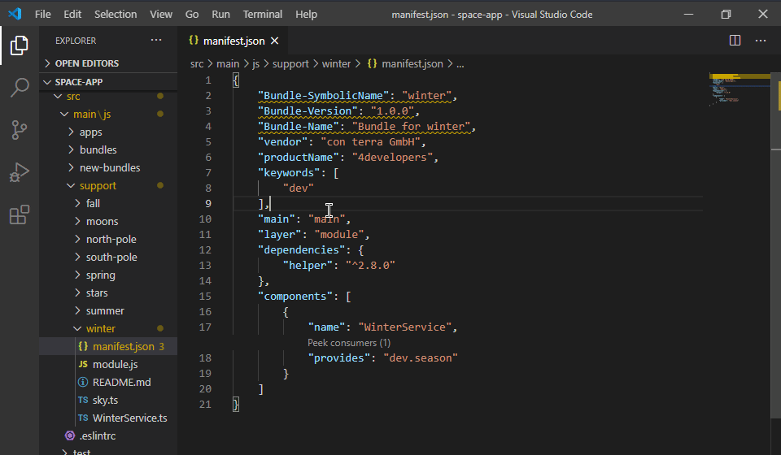
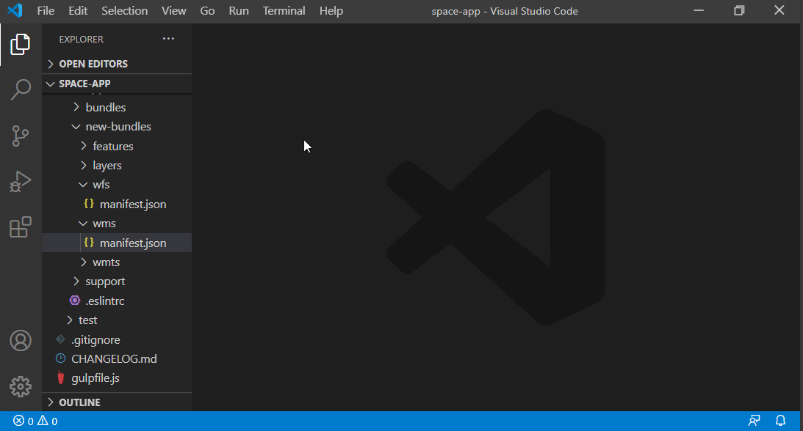
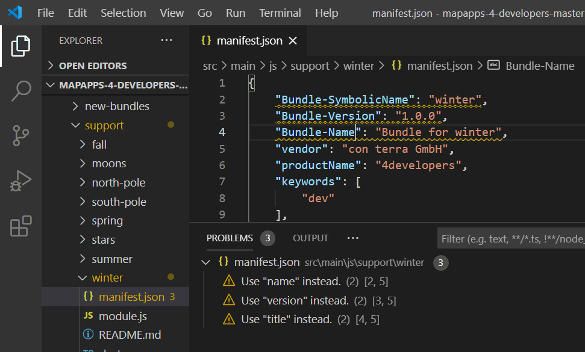
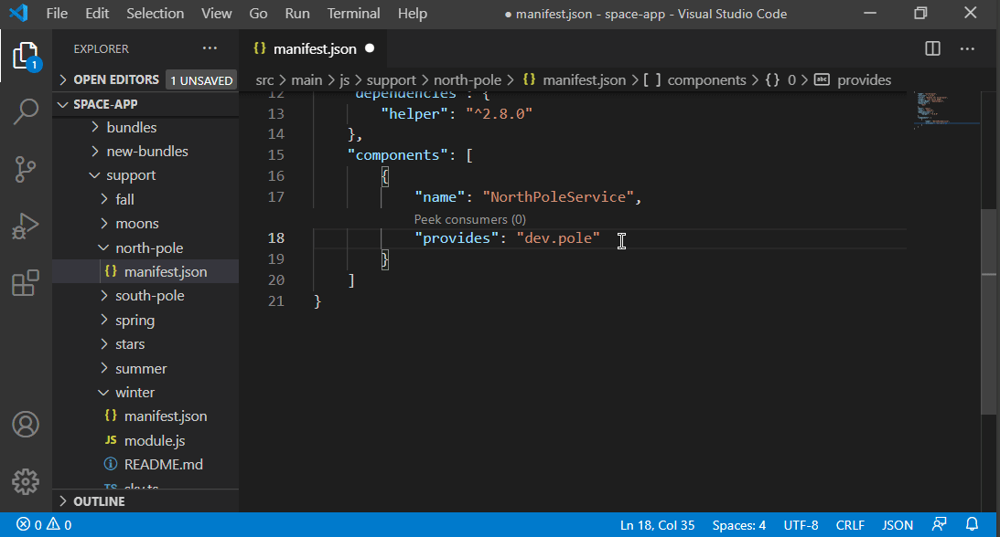

# 0.3.0

This version consequently improves navigation between code and manifest of a bundle.

* **[Go to definition](#go-to-component-implementation)** - Ctrl-Click on a component's name in the manifest to jump to its implementation file.
* **[Quick access](#qickly-access-manifest-and-readme)** - Directly open manifest.json or README&#46;md 
* **[Open bundles](#open-bundles-even-quicker)** - Not the only improvement to  the "Open bundle" command: recently used bundles are displayed on top of the list.
* **[Deprecation warnings](#highlight-deprecated-manifest-elements)** - Deprecated manifest keys get highlighted
* **[Snippets](#improved-manifest-editing-snippets)** - Snippets for a selection of manifest keys will help you enter values without less key strokes.
* **[Exclude bundles](#exclude-distracting-bundles)** - Define folders that are ignored when searching for bundles or displaying them in lists. 

And, of course, one bug fix properly listed in the [changelog](CHANGELOG.html).

## Go to component implementation

In `manifest.json` files, execute the "Go to Definition" command on the name or `"impl"` property value of a component to open the corresponding implementation file.
This is equivalent to a `Ctrl-Click` or pressing `F12`.

This works for components where the `"name"` or `"impl"` property matches the file name of a `.js` or `.ts` file inside the bundle folder.
But sometimes the component is mapped to another source file in the `module.js`.
In that case executing the command has no effect.

## Qickly access manifest and readme

In whatever file of a bundle you are working at the moment, hit `Shift-Ctrl-P`, enter _`mani`_, hit `Enter` -- and find yourself in the `manifest.json` file of the same bundle.
This is the work of on of the two new commands "apprt-bundles: Open current manifest.json" and "apprt-bundles: Open current README.md" you will find in the command palette.

## Open bundles even quicker

The last release introduced the "Open bundle" command that displays a filtering list of all available bundles.
If you pick one, depending on your configuration, it reveals the selected bundle's folder or the manifest file.

This feature got several smaller changes that all aim to improve your experience when navigating between bundles.
The most visible change is the *bundle hotlist*: The five most recently opened bundles are displayed on top of the list, tagged by a star.
The hotlist only appears, when there are more than five bundles, by the way.

The less visible changes to the pick list are:
* The filter not only matches the bundle name but also the path that might precede the bundle
* The bundle path (the text behind the bundle name) does not contain the bundle name any more.
This makes it *far* easier to realize which bundles are sharing the same parent folder.

One change needs a bit more explanation:
Revealing the `manifest.json` file of the selected bundle in the Explorer view is the new default (in contrast to just revealing the bundle *folder*).
The advantage of this new default is that you can always just hit `Enter` to really open the manifest file right after executing the "Open bundle" command.
Jumping between bundles made easy!

You can still suppress this behaviour in the extension config.
In this context, the config properties to control the "reveal" behaviour of this command were restructured.
The already existing property  `apprtbundles.bundles.reveal.goal.type` got an additional options while `apprtbundles.bundles.reveal.goal.expandFolder` became obsolete and was removed.

## Highlight deprecated manifest elements

Some app.rt manifests properties have been renamed in the past.
For example the property key `"name"` replaces the old key `"Bundle-SymbolicName"`. 
You may still use the old names but they are deprecated.

New in this release:
When an open manifest file uses one these keys, they are underlined.
And a deprecation message is displayed in the Problems view.
Deprecated keys are not auto-suggested any more.

## Improved manifest editing snippets

Since its first version this extension provides auto-completion proposals when editing `manifest.json` files.
The proposals for some keys now offer *snippets* that support you filling in data for more complex structures jumping to required inputs using the `Tab key`.

Try this by adding a new reference to a component:

## Exclude distracting bundles

Some projects contain a lot of bundles that only serve as a sample or for testing purposes.
To prevent these bundles from spamming the *> Open bundle* pick list, you can can now configure paths to bundles that should be excluded from the pick list.
The property `apprtbundles.bundles.hidePaths` takes a list of path glob patterns.
Any bundle with a path matching one the patterns will be excluded from the pick list.

The following glob patterns define paths of bundles that are hidden by default:
* `**/sample/apps/**`
* `**/tests/**`
* `**/src/test/**`

There is a second new property that you can use to exclude bundles from *all features* of this extension: `apprtbundles.bundles.ignorePaths`.
If a bundle has a path matching one of the glob patterns defined here, it will be ignored by this extension completely.
These bundles will not appear when searching service name references or using any other feature of this extension.   
IntelliSense features (like auto-suggest or searching for service name references) won't work when editing `manifest.json` files of those bundles.

The following glob patterns define paths of bundles that are ignored by default:
* `**/node_modules/**`
* `**/target/**`
